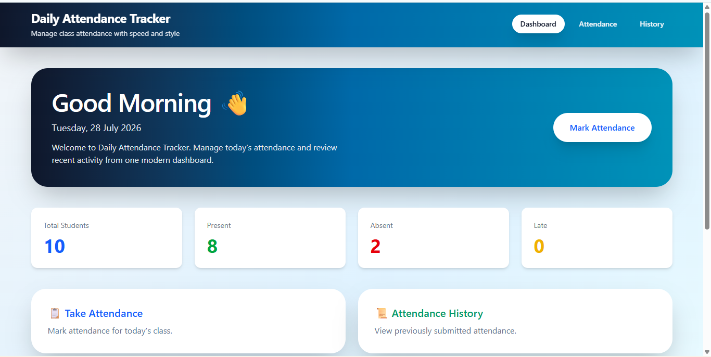
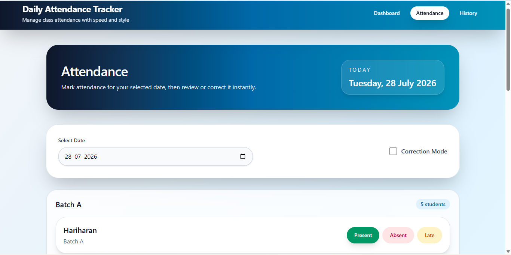
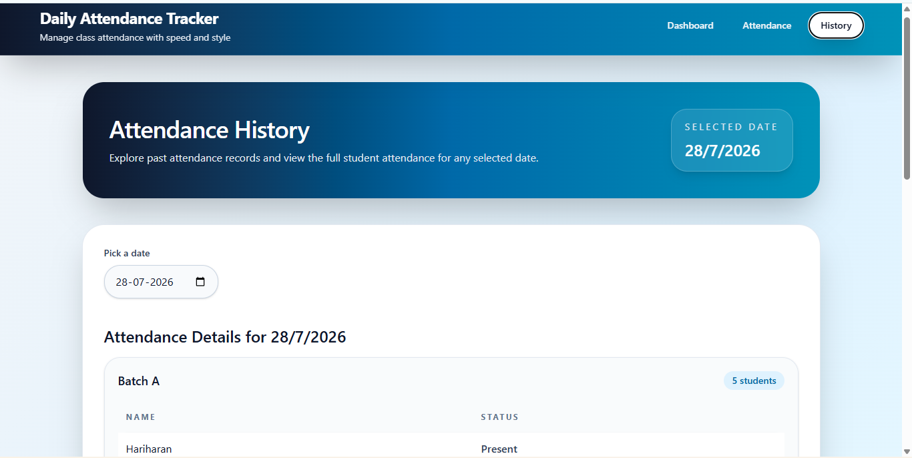

# 📚 Daily Attendance Tracker

A full-stack **Attendance Management System** built using **React, Tailwind CSS, Node.js, Express.js, and PostgreSQL**.

The application allows teachers to record daily attendance, prevent duplicate entries, make attendance corrections, and view attendance history through a clean and responsive interface.

---

## ✨ Features

- 📊 Modern Dashboard
- 👨‍🎓 Student Attendance Management
- 📅 Mark attendance for any date
- 🔄 Correction Mode for updating attendance
- 🚫 Prevent duplicate attendance records
- 📜 Attendance History
- 📱 Fully Responsive UI
- ⚡ REST API with Express.js
- 🐘 PostgreSQL Database

---

## 🛠️ Tech Stack

### Frontend
- React
- Vite
- Tailwind CSS
- React Router DOM
- Axios

### Backend
- Node.js
- Express.js

### Database
- PostgreSQL
- pg (Node PostgreSQL Driver)

---

## 📸 Screenshots

> Add screenshots after completing your project.

### Dashboard



---

### Attendance Page



---

### History Page



---

## 📂 Project Structure

```text
attendance-tracker/
│
├── client/
│   ├── src/
│   │   ├── components/
│   │   ├── pages/
│   │   ├── services/
│   │   ├── App.jsx
│   │   └── main.jsx
│   ├── package.json
│   └── ...
│
├── server/
│   ├── config/
│   ├── controllers/
│   ├── routes/
│   ├── database/
│   │   ├── schema.sql
│   │   └── seed.sql
│   ├── .env.example
│   ├── package.json
│   └── index.js
│
├── screenshots/
├── .gitignore
└── README.md
```

---

# 🚀 Getting Started

## 1. Clone the Repository

```bash
git clone https://github.com/your-username/attendance-tracker.git

cd attendance-tracker
```

---

## 2. Setup the Database

Create a PostgreSQL database.

Example:

```sql
CREATE DATABASE attendance_tracking2;
```

Import the database schema.

```bash
psql -U postgres -d attendance_tracking2 -f server/database/schema.sql
```

Import sample student data.

```bash
psql -U postgres -d attendance_tracking2 -f server/database/seed.sql
```

---

## 3. Configure Environment Variables

Create a `.env` file inside the `server` folder.

```env
DB_HOST=localhost
DB_PORT=5432
DB_USER=postgres
DB_PASSWORD=your_password
DB_NAME=attendance_tracking2
```

---

## 4. Install Dependencies

### Backend

```bash
cd server

npm install
```

### Frontend

```bash
cd ../client

npm install
```

---

## 5. Run the Application

### Start Backend

```bash
cd server

npm run dev
```

Backend runs on:

```
http://localhost:5000
```

---

### Start Frontend

Open another terminal.

```bash
cd client

npm run dev
```

Frontend runs on:

```
http://localhost:5173
```

---

# 📡 API Endpoints

| Method | Endpoint | Description |
|---------|----------|-------------|
| GET | `/api/students` | Get all students |
| GET | `/api/history` | Get attendance history |
| GET | `/api/attendance/:date` | Get attendance by date |
| POST | `/api/attendance` | Save attendance |

---

# ✅ Business Rules

- Future attendance dates are not allowed.
- Duplicate attendance is prevented.
- Correction Mode allows updating existing attendance.
- Attendance is stored in PostgreSQL.

---

# 📱 Application Pages

### Dashboard

- View total students
- View latest attendance summary
- Quick navigation to Attendance and History

### Attendance

- Select attendance date
- Mark Present, Absent, or Late
- Enable Correction Mode
- Save attendance

### History

- View attendance history
- Review attendance summary for each date

---

# 📌 Future Improvements

- Student Search
- Export Attendance to Excel
- Export Attendance to PDF
- Attendance Charts
- User Authentication
- Role-based Access Control

---

# 👨‍💻 Author

**Hariharan**

GitHub: https://github.com/your-username

---

# ⭐ Acknowledgement

This project was developed as part of a Full Stack Developer assessment to demonstrate skills in React, Node.js, Express.js, PostgreSQL, REST APIs, and responsive UI development.